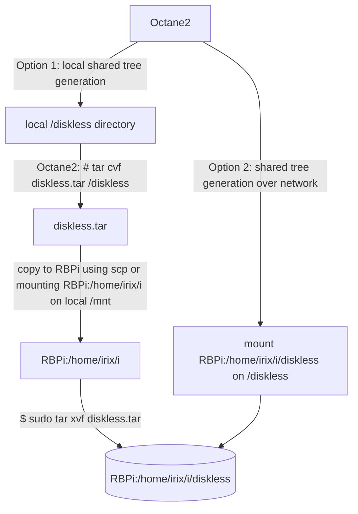
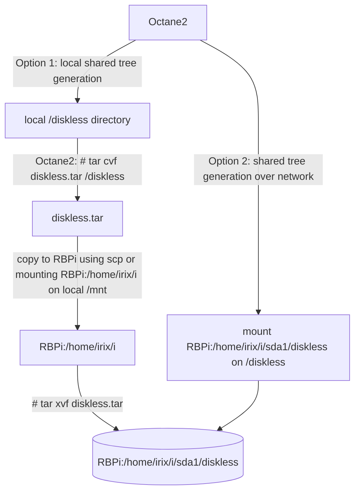
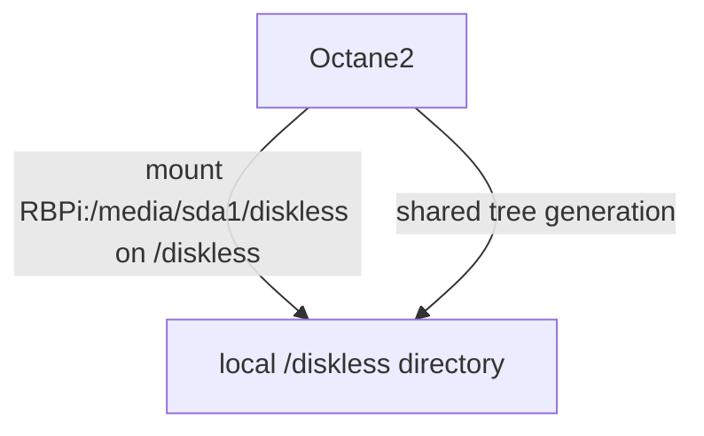

# IRIX diskless workstation using Reanimator
<br>
The purpose of this guide is to show how to boot an IRIX diskless workstation using Reanimator http://irix.mersisl.com/<br>
<br>
<h2>Requeriments</h2>
<ul>
  <li>1. Read the guide "Diskless Workstation Administration Guide" https://irix7.com/techpubs/007-0855-080.pdf and understand the complete process. This guide contains too much literature and it is not very concrete, you can explain the same in 10 pages.</li>
  <li>2. sgi computer to work as <b>diskless server</b>, it will only <b>generate</b> the diskless tree. I will use an Octane2.</li>
  <li>3. sgi computer to work as <b>diskless workstation</b>, it could be the same than (2). I will use an Indy.</li>
  <li>4. Raspberry Pi+Reanimator to work as <b>diskless server</b>, providing <b>bootp and NFS server</b> services, NFS will serve the diskless tree generated by (2). Reanimator on VirtualBox should work too. I will use a Raspberry Pi.</li>
</ul>
<br>
I have tested three configurations:<br>
C1. RBPi working as bootp server and NAS. This is the easiest configuration to test a diskless workstation, keep in mind that the SD card will reduce its expected life time, due to the excess of write cycles.<br>
C2. To avoid the SD problem and increase the throughput, you can connect an external hard disk to an USB port on RBPi and use it as storage instead the SD card.<br>
C3. RBPi working as bootp server and using a separated NAS as storage. I have used as NAS (Network-attached storage https://en.wikipedia.org/wiki/Network-attached_storage) a think client with Debian GNU/Linux and NFS, you don't need to use a professional solution.<br>
<br>
I assume that you are using a file system that is compatible with GNU/Linux file permissions, such as ext4.<br>
<br>
You can use any of the three configurations, the procedure is the same, you only need to modify the directory paths.<br>
<br>
According to my experience, shared tree generation over network is much slower, it's faster to backup the diskless directory with tar and restore it on the destination machine. Please, try both methods and decide yourself.<br>
<br>
<h2>Procedure</h2>
<h3>1. Creating a directory to store the diskless tree</h3>
C1. Create a directory on /home/irix/i named diskless:<br>

```
# directory /home/irix/i/diskless is provided with the right permissions, skip these steps for option 2
$ sudo mkdir /home/irix/i/diskless
$ sudo 777 /home/irix/i/diskless

```



C2. The path changes depending on your usb device and mounting point, if you use Reanimator's menus the path is /home/iris/i/sda1. Create there a directory named diskless.<br>



C3. The path changes depending on your drive device and mounting point, let's suppose the drive is mounted on /media/sda1. Create there a directory named diskless.<br>



- Modify directory permissions:<br>

```
% chmod 777 diskless

```
<h3>2. Preparing the IRIX server to generate the diskless tree</h3>
Verify the diskless server subsystem is installed:<br>

```
% versions nfs

```
If the subsystem is not installed, you can install it from the media "ONC3/NFS Version 3 for IRIX 6.2, 6.3, 6.4, and 6.5".<br>
Download this media on Reanimator(2. Download menu --> 7. Download IRIX 6.5.x) and proceed:<br>

```
% inst
1. open
Type irix@rbpi:i/IRIX/irix65x/nfs/dist
11. done
..
keep *
install nfs.sw.dskless_server
go
```
<h3>3. Run share_setup to create a share tree configuration file (share.dat):</h3>

```
% ./share_setup
----------
This program will help you create a share tree configuration file for a 
single IRIX version.  Create a separate share tree configuration file for
a 32-bit and a 64-bit version of the same IRIX release.

Retrieving system information...

Hostname is octane2
If you wish to use a different interface name for this host, enter it now
(Press return if octane2 is ok): 

Do you want client boot information stored on octane2 (y/n)? y --> SERVER_NIS="no"
----------
if "n":
Make sure octane2 is listed in the NIS server's /etc/updaters file.
----------
Enter the root directory of the diskless tree 
(e.g. /diskless) : /diskless

Enter the name of the share tree (e.g. IRIX65): 6.5.22

Share tree will be installed at /diskless/share/6.5.22

Enter the name of the share tree configuration file (no extension please): 6.5.22

Share tree configuration file will be written at /var/boot/6.5.22.dat
Press [Enter] to continue
----------
***CLIENT ARCHITECTURE INFORMATION***


*** PLEASE READ CAREFULLY ***
If you are using a 32 bit machine as your diskless server, you can only
install share trees for 32 bit platforms.  If you have a 64 bit server,
you can install either a 32 or a 64 bit share tree.

Do you want to install a share tree for all client platforms (y or n): y
Which version would you like:
        1. 32bit
        2. 64bit
Choose one (1 or 2): 1
Storing share tree configuration file at /var/boot/6.5.22.dat

```
<h3>4. Run share_inst to install the share tree:</h3>

```
./share_inst -r 6.5.22
About to install shared tree at /mnt/diskless/share/6.5.22......
Enter confirmation (y/Y):y
Which installation tool would you like to use:
        1. inst
        2. Software Manager

Your choice (1 or 2): 1
13. admin
15. load filename
irix@rbpi:i/6.5.22.txt
11. done
..
keep *
install maintenance
install nfs.sw.dskless_client
Inst> co

Overlay product nfs.sw.dskless_client (1289662620) cannot be installed
because of missing prerequisites: base product nfs.sw.dskless_client
(1274627335)
  1a. Do not install nfs.sw.dskless_client (1289662620)
  1b. Also install base product nfs.sw.dskless_client (1274627335) (see
      ONC3/NFS VERSION-3 FOR IRIX 6.2 THROUGH 6.5 CD) from an additional
      distribution -- insert another CD or specify another software
      distribution


Resolve conflicts by typing "conflicts choice choice ..."
or try "help conflicts"

Inst> conflicts 1b
irix@rbpi:i/IRIX/irix65x/nfs/dist

Inst> co

nfs.sw.dskless_client cannot be installed because of missing prerequisites:
  1a. Do not install nfs.sw.dskless_client (1289662620)
  1b. Also install nfs.sw.nfs (1289662620).

Resolve conflicts by typing "conflicts choice choice ..."
or try "help conflicts"

Inst> co 1b
No conflicts

Inst> go
----------
if /diskless is a NFS share, this message is displayed:
Pre-installation check ..   7% 
The installation request will install or remove files in the following nfs-mounted filesystems:
  /diskless

Please cancel or confirm the request.
1. Cancel the installation request
2. Continue the installation request
Please enter a choice [1]: 2

```
<h3>5. Run client_setup to create a client tree configuration file (client.dat).</h3>

```
% ./client_setup
perl: warning: Setting locale failed.
perl: warning: Please check that your locale settings:
        LC_ALL = (unset),
        LANG = "es_ES.UTF-8"
    are supported and installed on your system.
perl: warning: Falling back to the standard locale ("C").

This program will help you create a client tree configuration file for the
 client you would like to install.


Choose the CPU board:
        1. IP20
        2. IP22
        3. IP28
        4. IP30
        5. IP32
        6. IP35

Choose one (1 2 3 4 5 6 ): 2
>> IP22 selected.
Choose the CPU architecture:
        1. R4000
        2. R5000

Choose one (1 2 ): 1
>> R4000 selected.
Choose the graphics board:
        1. EXPRESS
        2. NEWPRESS
        3. NEWPORT
        4. MGRA S

Choose one (1 2 3 4 ): 3
>> NEWPORT selected.
Choose the video card:
        1. Not installed
        2. VINO

Choose one (1 2 ): 2
>> VINO selected.
You have defined a client class with these components: 
        CPUBOARD=IP22
        CPUARCH=R4000
        GFXBOARD=NEWPORT -mSUBGR=NG1
        VIDEO=VINO
        MODE=32bit

Specify a size in MB for swap.
Swap size (Default is 64m - <Enter> for default):8
Enter your NIS domain name (hit <Enter> for no domainname): 
Specify a name for your client tree configuration file (no extension 
please): indy
Creating file indy.dat
```
