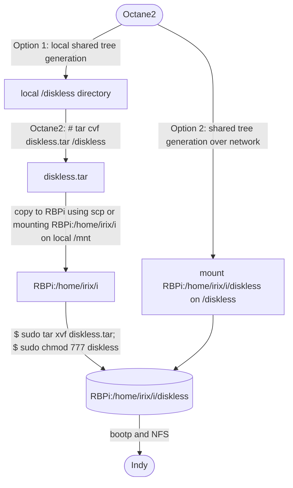
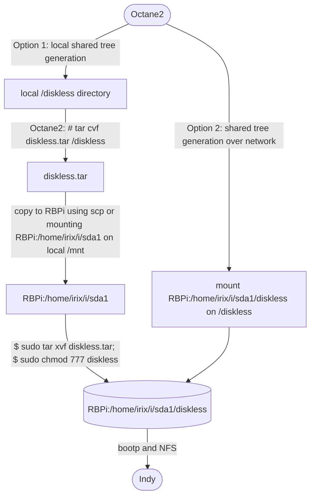
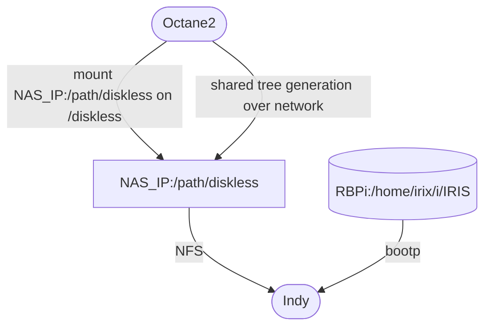

Last update: 2022/05/13<br>
# IRIX diskless workstation using Reanimator
<br>
The purpose of this guide is to show how to boot an IRIX diskless workstation using Reanimator http://irix.mersisl.com/<br>
<br>
<h2>Requeriments</h2>
<ul>
  <li>1. Read the guide "Diskless Workstation Administration Guide" https://irix7.com/techpubs/007-0855-080.pdf and understand the complete process. This guide contains too much literature and it is not very concrete, you can explain the same in 10 pages.</li>
  <li>2. sgi computer to work as <b>diskless server</b>, it will only <b>generate</b> the diskless tree. I will use an Octane2.</li>
  <li>3. sgi computer to work as <b>diskless workstation</b>, it could be the same than (2). I will use an Indy.</li>
  <li>4. Raspberry Pi+Reanimator to work as <b>diskless server</b>, providing <b>bootp and NFS server</b> services, NFS will serve the diskless tree generated by (2). Reanimator on VirtualBox should work too. I will use a Raspberry Pi.</li>
</ul>
<br>
I have tested three configurations:<br>
C1. RBPi/VirtualBox working as bootp server and NFS server. This is the easiest configuration to test a diskless workstation, if using RBPi keep in mind that the SD card will reduce its expected life time, due to the excess of write cycles.<br>
C2. (RBPi only) To avoid the SD problem and increase the throughput, you can connect an external hard disk to an USB port on RBPi and use it as storage instead the SD card.<br>
C3. RBPi/VirtualBox working as bootp server and using a separated NFS NAS as storage (NFS 4.x disabled). I have used as NAS (Network-attached storage https://en.wikipedia.org/wiki/Network-attached_storage) a think client with Debian GNU/Linux and NFS, you don't need to use a professional solution.<br>
<br>
I assume that you are using a file system that is compatible with GNU/Linux file permissions, such as ext4.<br>
<br>
You can use any of the three configurations, the procedure is the same, you only need to modify the directory paths.<br>
<br>
According to my experience, shared tree generation over network is much slower, it's faster to backup the diskless directory with tar and restore it on the destination machine. Please, try both methods and decide yourself.<br>
<br>
<h2>Procedure</h2>
<h3>1. Creating a directory to store the diskless tree</h3>
C1. bootp+NFS. The directories /home/irix/i and /home/irix/i/diskless exist and are shared via NFS. You can choose between local shared tree generation (complex but faster) and shared tree generation over network (easier but slower):<br>



C2. (RBPi only) bootp+NFS+USB drive. The directory /home/irix/i/sda1 is shared via NFS. You can choose between local shared tree generation (complex but faster) and shared tree generation over network (easier but slower).<br>

The path can change depending on your usb device and mount point, if you use Reanimator's menus, the path is /home/iris/i/sda1. The directory diskless must be created on the <b>mounted</b> USB drive:<br>

```
# drive mounted using Reanimator's default path /home/irix/i/sda1
$ sudo mkdir /home/irix/i/sda1/diskless
$ sudo chmod 777 /home/irix/i/sda1/diskless

# uncomment this line on /etc/exports and run "sudo service nfs-kernel-server restart" to apply changes
#/home/irix/i/sda1/diskless             *(rw,no_root_squash,no_subtree_check)

# add this line on /etc/fstab to automount USB drive on boot
/dev/sda1 /home/irix/i/sda1 auto  defaults  0 0
```

You can also use a custom path:
```
# drive mounted using a custom path
$ sudo mount /dev/sda1 /my_path
$ sudo mkdir /my_path/diskless
$ sudo chmod 777 /my_path/diskless

# add the path on /etc/exports and run "sudo service nfs-kernel-server restart" to apply changes
/my_path/diskless			*(rw,no_root_squash,no_subtree_check)

# add this line on /etc/fstab to automount USB drive on boot
/dev/sda1 /my_path auto  defaults  0 0
```

If you choose the shared tree generation over network, the USB drive must be mounted on /home/irix/i/sda1 (or /my_path). Keep in mind that nfs-kernel-server <b>won't work</b> if USB drive is not mountend on boot and the mount directories exported on /etc/exports, you must run "sudo service nfs-kernel-server restart" after mounting the USB drive<br>




C3. bootp+separated NFS NAS storage. Only shared tree generation over network is supported:<br>



<h3>2. Preparing the IRIX server to generate the diskless tree</h3>
Verify the diskless server subsystem (nfs.sw.dskless_server) is installed:<br>

```
# versions nfs

```
If the subsystem is not installed, you can install it from the media "ONC3/NFS Version 3 for IRIX 6.2, 6.3, 6.4, and 6.5".<br>
Download this media on Reanimator(2. Download menu --> 7. Download IRIX 6.5.x) and proceed:<br>

```
# inst
1. open
Type irix@rbpi:i/IRIX/irix65x/nfs/dist

keep *
install nfs.sw.dskless_server
go
```
<h3>3. Overview of the installation procedure</h3>
Some remarks:<br>
<ul>
  <li>A diskless tree contains one shared tree for each release of IRIX that it supports.</li>
  <li>The shared tree contains the portion of the IRIX operating system that can be shared by a group of diskless clients.</li>
  <li>A client tree contains the IRIX kernel for an individual client, the specific hardware files that the client requires, and private files such as /etc/hosts, /etc/fstab, and /etc/sys_id.</li>
  <li>The swap tree provides the disk space that an individual client needs for virtual memory operations.</li>
  <li>A class is a group of workstations that contain identical CPU and graphics hardware. A class is generally (but not always) designated by a model name, such as O2™ or Octane™. A client class requires its own hardware-specific software modules. For this reason, a shared tree must contain all the hardware-specific modules needed to support every class in its client base. By contrast, a client tree contains only those hardware-specific modules
needed to support the individual client that is using it.</li>
</ul>
Example: diskless tree = (shared tree 6.5.22+client tree 1_1+swap tree 1_1+client tree 1_2+swap tree 1_2)+(shared tree 6.5.30+client tree 2_1+swap tree 2_1+client tree 2_2+swap tree 2_2)
<br>
<br>
Installation steps:
<ul>
  <li>Run share_setup to create a shared tree configuration file (share.dat).</li>
  <li>Run share_inst to install the shared tree.</li>
  <li>Run client_setup to create a client tree configuration file (client.dat).</li>
  <li>Run clone_client to reproduce the client and swap trees for additional clients.</li>
  <li>Boot each client and verify the installation.</li>
</ul>
Example:<br>
  <li>IRIS Indy 6.5.22 32 bits</li>
  <li>IRIS2 Octane2 6.5.30 64 bits</li>

```
# cd /var/boot
# ./share_setup
... (Storing share tree configuration file at /var/boot/6.5.22.dat)
./share_setup
... (Storing share tree configuration file at /var/boot/6.5.30.dat)

# ./share_inst -r 6.5.22
... 
13. admin
15. load filename
Load selections from file: irix@rbpi:i/6.5.22.txt
11 done
..
Inst> keep *
Inst> install maintenance
Inst> install nfs.sw.dskless_client
Inst> conflicts
...
(6.5.22 share tree installed at /diskless/share/6.5.22)
# ./share_inst -r 6.5.30
... 
13. admin
15. load filename
Load selections from file: irix@rbpi:i/6.5.30.txt
11 done
..
Inst> keep *
Inst> install maintenance
Inst> install nfs.sw.dskless_client
Inst> conflicts
...
(6.5.30 share tree installed at /diskless/share/6.5.30)

# ./client_setup
...
IP22
...
(Creating file indy.dat)
# ./client_setup
...
IP30
...
(Creating file octane2.dat)

# ./client_inst -h IRIS -r 6.5.22 -c indy
... 
13. admin
15. load filename
Load selections from file: irix@rbpi:i/6.5.22.txt
11 done
..
Inst> keep *
Inst> install nfs.sw.dskless_client
Inst> conflicts
...
(indy client tree installed to /diskless/client/indy)
# ./client_inst -h IRIS2 -r 6.5.30 -c octane2
... 
13. admin
15. load filename
Load selections from file: irix@rbpi:i/6.5.30.txt
11 done
..
Inst> keep *
Inst> install nfs.sw.dskless_client
Inst> conflicts
...
(octane client tree installed to /diskless/client/octane)
```

<h3>4. Run share_setup to create a shared tree configuration file (share.dat)</h3>
Run share_setup for every shared tree: 6.5.22_32, 6.5.22_64, 6.5.30, ...<br>
Example for 6.5.22 32 bits:<br>

```
# cd /var/boot
# ./share_setup
----------
This program will help you create a shared tree configuration file for a 
single IRIX version.  Create a separate shared tree configuration file for
a 32-bit and a 64-bit version of the same IRIX release.

Retrieving system information...

Hostname is octane2
If you wish to use a different interface name for this host, enter it now
(Press return if octane2 is ok): 

Do you want client boot information stored on octane2 (y/n)? y --> SERVER_NIS="no" on .dat file
----------
if "n":
Make sure octane2 is listed in the NIS server's /etc/updaters file.
----------
Enter the root directory of the diskless tree 
(e.g. /diskless) : /diskless

Enter the name of the share tree (e.g. IRIX65): 6.5.22

Share tree will be installed at /diskless/share/6.5.22

Enter the name of the share tree configuration file (no extension please): 6.5.22

Share tree configuration file will be written at /var/boot/6.5.22.dat
Press [Enter] to continue
----------
***CLIENT ARCHITECTURE INFORMATION***


*** PLEASE READ CAREFULLY ***
If you are using a 32 bit machine as your diskless server, you can only
install share trees for 32 bit platforms.  If you have a 64 bit server,
you can install either a 32 or a 64 bit share tree.

Do you want to install a share tree for all client platforms (y or n): y
Which version would you like:
        1. 32bit
        2. 64bit
Choose one (1 or 2): 1
Storing share tree configuration file at /var/boot/6.5.22.dat
```
<h3>5. Run share_inst to install the shared tree</h3>
Run share_inst for every shared tree configuration: 6.5.22, 6.5.30, ...<br>
Example for 6.5.22 32 bits:<br>

```
# cd /var/boot
# ./share_inst -r 6.5.22
About to install shared tree at /mnt/diskless/share/6.5.22......
Enter confirmation (y/Y):y
Which installation tool would you like to use:
        1. inst
        2. Software Manager

Your choice (1 or 2): 1
13. admin
15. load filename
Load selections from file: irix@rbpi:i/6.5.22.txt
11 done
..
Inst> keep *
Inst> install maintenance
Inst> install nfs.sw.dskless_client
Inst> conflicts

Overlay product nfs.sw.dskless_client (1289434520) cannot be installed
because of missing prerequisites: base product nfs.sw.dskless_client
(1274627335)
  1a. Do not install nfs.sw.dskless_client (1289434520)
  1b. Also install base product nfs.sw.dskless_client (1274627335) (see
      ONC3/NFS VERSION-3 FOR IRIX 6.2 THROUGH 6.5 CD) from an additional
      distribution -- insert another CD or specify another software
      distribution

java2_plugin.sw32.mozilla_freeware cannot be installed because of missing
prerequisites:
  2a. Do not install java2_plugin.sw32.mozilla_freeware (1278918520)
  2b. Also install fw_mozilla.sw.mozilla (1278327220 - 2147483647) from an
      additional distribution -- insert another CD or specify another
      software distribution.


Resolve conflicts by typing "conflicts choice choice ..."
or try "help conflicts"

Inst> conflicts 1b 2a
Note: this operation opens a distribution and selects all
of its default or upgrade products for install.  If you
wish to open just a single product, append the product
name to the distribution name, as in /CDROM/dist/eoe.
See the "distribution" help topic for more information.
Enter new distribution from list:
...
Install software from: irix@rbpi:i/IRIX/irix65x/nfs/dist
...
Inst> conflicts

nfs.sw.dskless_client cannot be installed because of missing prerequisites:
  1a. Do not install nfs.sw.dskless_client (1289434520)
  1b. Also install nfs.sw.nfs (1289434520).


Resolve conflicts by typing "conflicts choice choice ..."
or try "help conflicts"

Inst> conflicts 1b
No conflicts

Inst> go
----------
if /diskless is a NFS share, this message is displayed:
Pre-installation check ..   7% 
The installation request will install or remove files in the following nfs-mounted filesystems:
  /diskless

Please cancel or confirm the request.
1. Cancel the installation request
2. Continue the installation request
Please enter a choice [1]: 2
----------
Inst> quit
```
<h3>6. Run client_setup to create a client tree configuration file (client.dat)</h3>
Run client_setup for every client class: Indy, Octane, ...<br>
Example for Indy:<br>

```
# ./client_setup
----------
This program will help you create a client tree configuration file for the
 client you would like to install.


Choose the CPU board:
        1. IP20
        2. IP22
        3. IP28
        4. IP30
        5. IP32
        6. IP35

Choose one (1 2 3 4 5 6 ): 2
>> IP22 selected.
Choose the CPU architecture:
        1. R4000
        2. R5000

Choose one (1 2 ): 1
>> R4000 selected.
Choose the graphics board:
        1. EXPRESS
        2. NEWPRESS
        3. NEWPORT
        4. MGRA S

Choose one (1 2 3 4 ): 3
>> NEWPORT selected.
Choose the video card:
        1. Not installed
        2. VINO

Choose one (1 2 ): 2
>> VINO selected.
You have defined a client class with these components: 
        CPUBOARD=IP22
        CPUARCH=R4000
        GFXBOARD=NEWPORT -mSUBGR=NG1
        VIDEO=VINO
        MODE=32bit

Specify a size in MB for swap.
Swap size (Default is 64m - <Enter> for default):
Enter your NIS domain name (hit <Enter> for no domainname): 
Specify a name for your client tree configuration file (no extension 
please): indy
Creating file indy.dat
```
<h3>7. Run client_inst to install the client</h3>
Run client_inst for every shared tree configuration and client class:<br>

```
# ./client_inst -h IRIS2 -r 6.5.30 -c octane2
...
# ./client_inst -h IRIS -r 6.5.22 -c indy

Client tree = /diskless/client/IRIS, shared tree = /diskless/share/6.5.22
Enter confirmation (y/Y) :y
Create 64m swap file ........
Which installation tool would you like to use:
        1. inst
        2. Software Manager

Your choice (1 or 2): 1

13. admin ...
15. load filename
Load selections from file: irix@rbpi:i/6.5.22.txt
11 done
..
Inst> keep *
Inst> install nfs.sw.dskless_client
Inst> conflicts

c++_eoe.sw.lib, compiler_eoe.sw.cpp, compiler_eoe.sw.lboot,
compiler_eoe.sw.lib, compiler_eoe.sw.unix, eoe.sw.base, eoe.sw.efs,
eoe.sw.gfx, x_eoe.sw.Server, x_eoe.sw.Xfonts and x_eoe.sw.eoe are required
and must be installed
  1a. Also install c++_eoe.sw.lib (1279199410), compiler_eoe.sw.cpp
      (1279199410), compiler_eoe.sw.lboot (1279199410), compiler_eoe.sw.lib
      (1279199410), compiler_eoe.sw.unix (1279199410), eoe.sw.base
      (1289434520), eoe.sw.efs (1289434520), eoe.sw.gfx (1289434520),
      x_eoe.sw.Server (1289434520), x_eoe.sw.Xfonts (1289434520) and
      x_eoe.sw.eoe (1289434520)

Overlay product nfs.sw.dskless_client (1289434520) cannot be installed
because of missing prerequisites: base product nfs.sw.dskless_client
(1274627335)
  2a. Do not install nfs.sw.dskless_client (1289434520)
  2b. Also install base product nfs.sw.dskless_client (1274627335) (see
      ONC3/NFS VERSION-3 FOR IRIX 6.2 THROUGH 6.5 CD) from an additional
      distribution -- insert another CD or specify another software
      distribution

nfs.sw.dskless_client cannot be installed because of missing prerequisites:
  3a. Do not install nfs.sw.dskless_client (1289434520)
  3b. Also install eoe.sw.base (1289434520).


Resolve conflicts by typing "conflicts choice choice ..."
or try "help conflicts"


Inst> conflicts 1a 2b 3b

Install software from: irix@rbpi:i/IRIX/irix65x/nfs/dist

Inst> conflicts

nfs.sw.dskless_client cannot be installed because of missing prerequisites:
  1a. Do not install nfs.sw.dskless_client (1289434520)
  1b. Also install nfs.sw.nfs (1289434520).


Resolve conflicts by typing "conflicts choice choice ..."
or try "help conflicts"

Inst> conflicts 1b
No conflicts

Inst> go

```
Let's have a look to some files on Octane2 to understand /etc/bootparams and /etc/exports on Reanimator:
```
# ls -l /var/boot/IRIS/
total 8
-rw-r--r--    1 root     sys          107 Apr 30 15:52 README
lrwxr-xr-x    1 root     sys           43 Apr 30 15:52 unix -> /diskless/share/6.5.22/sbin/stand/sash.ARCS
lrwxr-xr-x    1 root     sys           26 Apr 30 15:52 unix.auto -> /diskless/client/IRIS/unix
# ls -l /var/boot/IRIS2
total 8
-rw-r--r--    1 root     sys          107 Apr 30 16:53 README
lrwxr-xr-x    1 root     sys           27 Apr 30 16:53 unix -> /diskless/client/IRIS2/unix

# cat /etc/bootparams 
#
6.5.22 root=octane2:/diskless/share/6.5.22 sbin=octane2: swap=octane2:
IRIS root=octane2:/diskless/client/IRIS sbin=octane2:/diskless/share/6.5.22/sbin usr=octane2:/diskless/share/6.5.22/usr var_share=octane2:/diskless/share/6.5.22/var/share swap=octane2:/diskless/swap/IRIS
6.5.30 root=octane2:/diskless/share/6.5.30 sbin=octane2: swap=octane2:
IRIS2 root=octane2:/diskless/client/IRIS2 sbin=octane2:/diskless/share/6.5.30/sbin usr=octane2:/diskless/share/6.5.30/usr var_share=octane2:/diskless/share/6.5.30/var/share swap=octane2:/diskless/swap/IRIS2


# cat /etc/exports
#
# NFS exported filesystem database (see exports(4) for more information).
#
# Entries in this file consist of lines containing the following fields:
#
# filesystem    [ options ]     [ netgroup ] [ hostname ] ...
#
# Filesystem must be left-justified and may name any directory within a
# local filesystem.  A backslash (\) at the end of a line permits splitting
# long lines into shorter ones.  Netgroup(4) and hostname refer 
# to machines or collections of machines to which filesystem is exported.
#
#/var/spool/pcnfs
/diskless/share/6.5.22/usr -mandlock,ro         #class=6.5.22
/diskless/share/6.5.22/sbin -mandlock,ro        #class=6.5.22
/diskless/share/6.5.22/var/share -mandlock,rw   #class=6.5.22
/diskless/client/IRIS -mandlock,rw=IRIS,access=IRIS,root=IRIS   #host=IRIS
/diskless/swap/IRIS -rw=IRIS,wsync,access=IRIS,root=IRIS        #host=IRIS
/diskless/share/6.5.30/usr -mandlock,ro         #class=6.5.30
/diskless/share/6.5.30/sbin -mandlock,ro        #class=6.5.30
/diskless/share/6.5.30/var/share -mandlock,rw   #class=6.5.30
/diskless/client/IRIS2 -mandlock,rw=IRIS2,access=IRIS2,root=IRIS2       #host=IRIS2
/diskless/swap/IRIS2 -rw=IRIS2,wsync,access=IRIS2,root=IRIS2    #host=IRIS2

```
Reanimator provides <b>preconfigured</b> /etc/bootparams and /etc/exports. Edit them using Reanimator's menus according to your configuration.<br>
<h3>8. Run clone_client to reproduce the client and swap trees for additional clients.</h3>
<b>Optional</b>. Some example of operations are provided as cheat sheet:<br>

```
# # clone /diskless/client/IRIS, using indy as client tree configuration file, 6.5.22 as shared tree configuration file and host names contained in IRIS3.txt
# # IRIS3 must be and identical machine to IRIS
# ./clone_client -f IRIS3.txt -r 6.5.22 -c indy -clone /diskless/client/IRIS

# # delete hostname IRIS
# ./client_inst -h IRIS -r 6.5.22 -c indy -d

# # create client IRIS (contained in IRIS.txt)
# ./clone_client -f IRIS.txt -r 6.5.22 -c indy -clone /diskless/client/IRIS3
```

<h3>9. Copying and restoring diskless.tar to Reanimator if you used local shared tree generation.</h3>

Example using configuration C1 and scp to copy Octane2-->RBPi:
```
# tar cvf /diskless.tar /diskless
# scp /diskless.tar pi@192.168.9.100:/home/irix/i
```

Example using configuration C2 and NFS to copy Octane2-->RBPi, the usb drive <b>must</b> be mounted:
```
# tar cvf /diskless.tar /diskless
# mount 192.168.9.100:/home/irix/i/sda1 /mnt
# cp /diskless.tar /mnt
# umount /mnt
```

Example using configuration C3, creating the file diskless.tar on a NAS shared resource. This is the <b>fastest method</b> in my opinion:
```
# mount NAS_IP:/path /mnt
# tar cvf /mnt/diskless.tar /diskless
# umount /mnt
```

Restoring on Reanimator:
```
# restoring on RBPi using configuration C2 (the usb drive must be mounted)
pi@rbpi:/home/irix/i/sda1 $ sudo tar xvf diskless.tar

# restoring on VirtualBox using configuration C1
sgi@debian:/home/irix/i $ sudo tar xvf diskless.tar
```
<h3>10. Boot each client and verify the installation.</h3>
You can clean on Reanimator the hosts from diskless/client/IRIS/etc/hosts and diskless/client/IRIS2/etc/hosts, they are not used. Make sure to update the hosts files, for example:<br>
<br>
diskless/client/IRIS/etc/hosts <b>original</b> file:<br>

```
# WARNING: As shipped by SGI this system has no passwords on the following
#          accounts: root, lp, nuucp, EZsetup, demos, OutOfBox, guest.
#          If you leave these or any other accounts open when you enable
#          networking, your system will be at significant risk for malicious
#          attacks.  Use the EZsetup GUI to close open accounts, or use
#          passwd(1) to accomplish the same thing from the command line.

#          See passwd(1), or EZsetup(1M) for more information.

#  IP address-hostname database (see hosts(4) for more information).


# Default IP address for a new IRIS. It should be changed immediately to 
# the address appropriate for your network.
# (The '192.0.2' network number is the officially blessed 'test' network.)

192.0.2.1       IRIS


# This entry must be present or the system will not work.
127.0.0.1       localhost


# Assigned multicast group addresses listed in RFC-1060 ("Assigned Numbers").
# These entries can be deleted if you don't want them.
# (They are also available via the Internet DNS name servers.)
224.0.0.1       all-systems.mcast.net
224.0.0.2       all-routers.mcast.net
224.0.0.4       dvmrp.mcast.net
224.0.0.5       ospf-all.mcast.net
224.0.0.6       ospf-dsig.mcast.net
224.0.1.1       ntp.mcast.net
224.0.1.2       sgi-dog.mcast.net
224.0.1.3       rwhod.mcast.net
224.0.2.1       rwho.mcast.net
224.0.2.2       sun-rpc.mcast.net
```
diskless/client/IRIS/etc/hosts <b>modified</b> file:<br>

```
# WARNING: As shipped by SGI this system has no passwords on the following
#          accounts: root, lp, nuucp, EZsetup, demos, OutOfBox, guest.
#          If you leave these or any other accounts open when you enable
#          networking, your system will be at significant risk for malicious
#          attacks.  Use the EZsetup GUI to close open accounts, or use
#          passwd(1) to accomplish the same thing from the command line.

#          See passwd(1), or EZsetup(1M) for more information.

#  IP address-hostname database (see hosts(4) for more information).


# Default IP address for a new IRIS. It should be changed immediately to 
# the address appropriate for your network.
# (The '192.0.2' network number is the officially blessed 'test' network.)

#192.0.2.1       IRIS
192.168.9.1       IRIS


# This entry must be present or the system will not work.
127.0.0.1       localhost


# Assigned multicast group addresses listed in RFC-1060 ("Assigned Numbers").
# These entries can be deleted if you don't want them.
# (They are also available via the Internet DNS name servers.)
224.0.0.1       all-systems.mcast.net
224.0.0.2       all-routers.mcast.net
224.0.0.4       dvmrp.mcast.net
224.0.0.5       ospf-all.mcast.net
224.0.0.6       ospf-dsig.mcast.net
224.0.1.1       ntp.mcast.net
224.0.1.2       sgi-dog.mcast.net
224.0.1.3       rwhod.mcast.net
224.0.2.1       rwho.mcast.net
224.0.2.2       sun-rpc.mcast.net
```
diskless/client/IRIS2/etc/hosts <b>original</b> file:<br>

```
#  IP address-hostname database (see hosts(4) for more information).
# Default IP address for a new IRIS. It should be changed immediately to 
# the address appropriate for your network.
# (The '192.0.2' network number is the officially blessed 'test' network.)
# 192.0.2.1     IRIS
# This entry must be present or the system will not work.
127.0.0.1       localhost
# Assigned multicast group addresses listed in RFC-1060 ("Assigned Numbers").
# These entries can be deleted if you don't want them.
# (They are also available via the Internet DNS name servers.)
224.0.0.1       all-systems.mcast.net
224.0.0.2       all-routers.mcast.net
224.0.0.4       dvmrp.mcast.net
224.0.0.5       ospf-all.mcast.net
224.0.0.6       ospf-dsig.mcast.net
224.0.1.1       ntp.mcast.net
224.0.1.2       sgi-dog.mcast.net
224.0.1.3       rwhod.mcast.net
224.0.2.1       rwho.mcast.net
224.0.2.2       sun-rpc.mcast.net
192.168.9.6     octane2
192.168.9.5     indy
192.168.9.100   rbpi
192.168.9.1     IRIS
192.168.9.2     IRIS2
```
diskless/client/IRIS/etc/hosts <b>modified</b> file:<br>

```
#  IP address-hostname database (see hosts(4) for more information).
# Default IP address for a new IRIS. It should be changed immediately to 
# the address appropriate for your network.
# (The '192.0.2' network number is the officially blessed 'test' network.)
# 192.0.2.1     IRIS
# This entry must be present or the system will not work.
127.0.0.1       localhost
# Assigned multicast group addresses listed in RFC-1060 ("Assigned Numbers").
# These entries can be deleted if you don't want them.
# (They are also available via the Internet DNS name servers.)
224.0.0.1       all-systems.mcast.net
224.0.0.2       all-routers.mcast.net
224.0.0.4       dvmrp.mcast.net
224.0.0.5       ospf-all.mcast.net
224.0.0.6       ospf-dsig.mcast.net
224.0.1.1       ntp.mcast.net
224.0.1.2       sgi-dog.mcast.net
224.0.1.3       rwhod.mcast.net
224.0.2.1       rwho.mcast.net
224.0.2.2       sun-rpc.mcast.net
192.168.9.2     IRIS2
```
Edit on Reanimator diskless/client/IRIS/etc/fstab and diskless/client/IRIS2/etc/fstab and another clients to boot from Reanimator or a NAS.<br>
Original file on Octane2:<br>

```
# cat /diskless/client/IRIS/etc/fstab
octane2:/diskless/client/IRIS / nfs rw 0 0
octane2:/diskless/share/6.5.22/usr /usr nfs ro 0 0
octane2:/diskless/share/6.5.22/sbin /sbin nfs ro 0 0
octane2:/diskless/share/6.5.22/var/share /var/share nfs rw 0 0
octane2:/diskless/swap/IRIS /swap nfs rw 0 0

# cat /diskless/client/IRIS2/etc/fstab
octane2:/diskless/client/IRIS2 / nfs rw 0 0
octane2:/diskless/share/6.5.30/usr /usr nfs ro 0 0
octane2:/diskless/share/6.5.30/sbin /sbin nfs ro 0 0
octane2:/diskless/share/6.5.30/var/share /var/share nfs rw 0 0
octane2:/diskless/swap/IRIS2 /swap nfs rw 0 0
```
<b>Modified</b> file on Reanimator to boot using C1. RBPi/VirtualBox(change IP to 192.168.9.101) working as bootp server and NFS server:
```
$ cat diskless/client/IRIS/etc/fstab
192.168.9.100:/home/irix/i/diskless/client/IRIS / nfs rw 0 0
192.168.9.100:/home/irix/i/diskless/share/6.5.22/usr /usr nfs ro 0 0
192.168.9.100:/home/irix/i/diskless/share/6.5.22/sbin /sbin nfs ro 0 0
192.168.9.100:/home/irix/i/diskless/share/6.5.22/var/share /var/share nfs rw 0 0
192.168.9.100:/home/irix/i/diskless/swap/IRIS /swap nfs rw 0 0

$ cat diskless/client/IRIS2/etc/fstab
192.168.9.100:/home/irix/i/diskless/client/IRIS2 / nfs rw 0 0
192.168.9.100:/home/irix/i/diskless/share/6.5.30/usr /usr nfs ro 0 0
192.168.9.100:/home/irix/i/diskless/share/6.5.30/sbin /sbin nfs ro 0 0
192.168.9.100:/home/irix/i/diskless/share/6.5.30/var/share /var/share nfs rw 0 0
192.168.9.100:/home/irix/i/diskless/swap/IRIS2 /swap nfs rw 0 0
```

<b>Modified</b> file on Reanimator to boot using C2. (RBPi only) bootp+NFS+external hard disk connected to an USB port on RBPi:
```
$ cat diskless/client/IRIS/etc/fstab
192.168.9.100:/home/irix/i/sda1/diskless/client/IRIS / nfs rw 0 0
192.168.9.100:/home/irix/i/sda1/diskless/share/6.5.22/usr /usr nfs ro 0 0
192.168.9.100:/home/irix/i/sda1/diskless/share/6.5.22/sbin /sbin nfs ro 0 0
192.168.9.100:/home/irix/i/sda1/diskless/share/6.5.22/var/share /var/share nfs rw 0 0
192.168.9.100:/home/irix/i/sda1/diskless/swap/IRIS /swap nfs rw 0 0

$ cat diskless/client/IRIS2/etc/fstab
192.168.9.100:/home/irix/i/sda1/diskless/client/IRIS2 / nfs rw 0 0
192.168.9.100:/home/irix/i/sda1/diskless/share/6.5.30/usr /usr nfs ro 0 0
192.168.9.100:/home/irix/i/sda1/diskless/share/6.5.30/sbin /sbin nfs ro 0 0
192.168.9.100:/home/irix/i/sda1/diskless/share/6.5.30/var/share /var/share nfs rw 0 0
192.168.9.100:/home/irix/i/sda1/diskless/swap/IRIS2 /swap nfs rw 0 0
```

<b>Modified</b> file on Reanimator to boot using C3. RBPi/VirtualBox working as bootp server and using a separated NFS NAS as storage:
```
$ cat diskless/client/IRIS/etc/fstab
# modify NAS IP and drive path /path according to your NAS configuration
NAS_IP:/path/diskless/client/IRIS / nfs rw 0 0
NAS_IP:/path/diskless/share/6.5.22/usr /usr nfs ro 0 0
NAS_IP:/path/diskless/share/6.5.22/sbin /sbin nfs ro 0 0
NAS_IP:/path/diskless/share/6.5.22/var/share /var/share nfs rw 0 0
NAS_IP:/path/diskless/swap/IRIS /swap nfs rw 0 0

$ cat diskless/client/IRIS2/etc/fstab
# modify NAS IP and drive path /path according to your NAS configuration
NAS_IP:/path/diskless/client/IRIS2 / nfs rw 0 0
NAS_IP:/path/diskless/share/6.5.30/usr /usr nfs ro 0 0
NAS_IP:/path/diskless/share/6.5.30/sbin /sbin nfs ro 0 0
NAS_IP:/path/diskless/share/6.5.30/var/share /var/share nfs rw 0 0
NAS_IP:/path/diskless/swap/IRIS2 /swap nfs rw 0 0
```

Run in Comand Monitor (example for Indy using C1 or C3):

```
>>setenv verbose on
>>setenv diskless 1
>>setenv netaddr 192.168.9.1
>>setenv OSLoader /unix
>>setenv SystemPartition bootp():i/diskless/client/IRIS
>>setenv OSLoadPartition bootp():i/diskless/client/IRIS
```
Run in Comand Monitor (example for Indy using C2):

```
>>setenv verbose on
>>setenv diskless 1
>>setenv netaddr 192.168.9.1
>>setenv OSLoader /unix
>>setenv SystemPartition bootp():i/sda1/diskless/client/IRIS
>>setenv OSLoadPartition bootp():i/sda1/diskless/client/IRIS
```
<h3>11. Troubleshooting.</h3>
<ul>
  <li>1. Read the troubleshooting section of "Diskless Workstation Administration Guide" https://irix7.com/techpubs/007-0855-080.pdf.</li>
  <li>2. Check the variables in Command Monitor.</li>
  <li>3. Check the names and the client IP in the file /home/irix/i/diskless/client/client_name/etc/hosts before booting. Keep in mind that the client IP will be assigned using DHCP on boot and updated in the hosts file, this will create boot problems. After booting, disable DHCP running "chkconfig autoconfig_ipaddress off" on the diskless client, and fix the IP address in Command Monitor, in hosts file and on the diskless client using https://software.majix.org/irix/network-setup.shtml.</li>
  <li>4. Check the paths and the server IP in file /home/irix/i/diskless/client/client_name/etc/fstab.</li>
  <li>5. If this message appears:<br>
    
```
/var/share: Unmounted
NFS server localhost (nsd) not responding still trying
```
Reboot and try again checking netaddr in Command Monitor, I don't know why it happens, I think it's related to DHCP.</li>
</ul>
<h3>12. Remarks.</h3>
<ul>
  <li>1. The first time my Indy boots, it takes about 30 minutes to complete the process using a RBPi 2 as server. It also reconfigures the operating system on boot (about 20') and the new kernel on shutdown (about 10'). These times are roughly halved if booting from a NAS. After these processes, the shutdown time is about 2 minutes.</li>
  <li>2. Some errors are displayed on boot: "not found", "cannot open", "Read-only file system", ... can they be avoided ?</li>
  <li>3. I installed the entire system (install maintenance) on the shared tree and just nfs.sw.dskless_client on the client tree, but IRIX diskless desktop appears too simple, it is necessary to install the maintenance branch on the client tree ?</li>
  <li>4. For my Octane2, "Automatically reconfiguring the operating system" takes about 8 minutes, but no desktop is started, it shows "The system is ready". The phase "Reconfiguring kernel, please wait" took about 7 minutes. After these processes, the boot time is about 1 minute. No desktop is shown, why ?</li>
  <li>5. After these results, a lot of tests and hours of fun are necessary to complete the table below. Please, send your feedback to rbpiuser@gmail.com</li>
</ul>
Summary:<br>
<table>
  <tr>
    <th>Client</th>
    <th>Server</th>
    <th>boot time</th>
    <th>shutdown time</th>
    <th>share_inst</th>
    <th>client_inst</th>
    <th>problems</th>
    <th>user</th>
  </tr>
  <tr>
    <td>Indy</td>
    <td>RBPi 2</td>
    <td>10'</td>
    <td>2'</td>
    <td>Inst> keep *<br>Inst> install maintenance<br>Inst> install nfs.sw.dskless_client</td>
    <td>Inst> install nfs.sw.dskless_client</td>
    <td>Simple desktop. Error on shutdown using Toolchest</td>
    <td>Linux-RISC</td>
  </tr>
  <tr>
    <td>Indy</td>
    <td>GNU/Linux NAS</td>
    <td>5'</td>
    <td>1'</td>
    <td>Inst> keep *<br>Inst> install maintenance<br>Inst> install nfs.sw.dskless_client</td>
    <td>Inst> install nfs.sw.dskless_client</td>
    <td>Simple desktop. Error on shutdown using Toolchest</td>
    <td>Linux-RISC</td>
  </tr>
  <tr>
    <td>Octane2</td>
    <td>GNU/Linux NAS</td>
    <td>1' 10''</td>
    <td>less than 1'</td>
    <td>Inst> keep *<br>Inst> install maintenance<br>Inst> install nfs.sw.dskless_client</td>
    <td>Inst> install nfs.sw.dskless_client</td>
    <td>No desktop started</td>
    <td>Linux-RISC</td>
  </tr>
</table>
